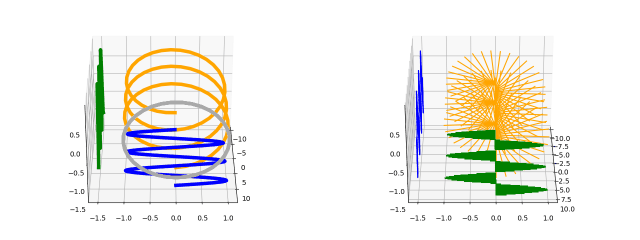
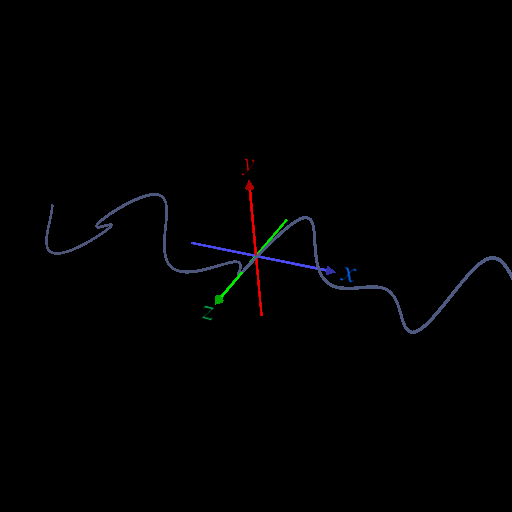
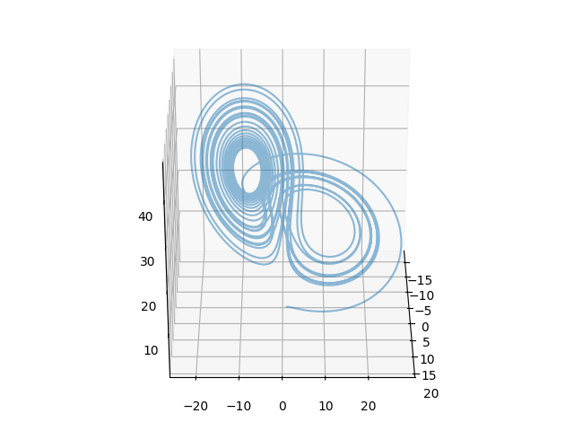
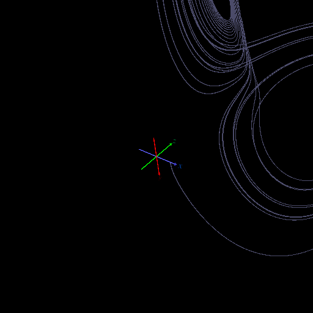

<html lang="ja">
    <head>
        <meta charset="utf-8" />
    </head>
<body>
<h1>
Curve
</h1>
<h2>なにものか？</h2>

パラメータつき曲線 (x(t),y(t)) を表示するプログラムです。 
・(t, x(t), y(t)) を 3D表示する。

<h3>環境構築</h3>

使用するパッケージ 
・Numpy  
・matplotlib　　　　･･･ matplotlib 版 
・PyOpenGL, glfw　･･･ OpenGL版 [検討中] 
 
・imageio　　　　　･･･ images_to_gif.py で連写したpngをgif化する場合 
・scipy　　　　　　･･･ 微分方程式を解いてplotする場合 

<h3>使い方</h3>

[0] config.ini の設定 
　　パラメータ付き曲線 (x(t),y(t)) のパラメータを指定します。

            <table border="1">
                <tr><th>項目</th><th>設定</th></tr>
                <tr><td>　nr_points　</td><td>　点の数 (例) 100　</td></tr>
                <tr><td>　tmin　</td><td>　t の最小値 (例) -np.pi * 3　</td></tr>
                <tr><td>　tmax　</td><td>　t の最大値 (例) np.pi * 3　</td></tr>
                <tr><td>　xt　</td><td>　x(t) の定義式 (例) np.sin(t)　</td></tr>
                <tr><td>　yt　</td><td>　y(t) の定義式 (例) np.cos(t)　</td></tr>
                <tr><td>　proj_t　</td><td>　t 方向の投影位置 (例) np.pi * 4　</td></tr>
                <tr><td>　proj_x　</td><td>　x 方向の投影位置 (例) -1.5　</td></tr>
                <tr><td>　proj_y　</td><td>　y 方向の投影位置 (例) -1.5　</td></tr>
            </table>

[1] matplotlib で曲線を表示する 
 
　　曲線を表示しマウスドラッグで視点を変える 
　　・python curve_matplotlib.py 
　　・python curve2_matplotlib.py 
 
　　視点を変えて曲線を連写する 
　　・python curve_continuous_shooting_matplotlib.py 
　　・python curve2_continuous_shooting_matplotlib.py 

[2] OpenGL で曲線を表示する 
 
　　曲線を表示しマウスドラッグで視点を変える 
　　・python curve_opengl.py 
 
　　視点を変えて曲線を連写する 
　　・python curve_continuous_shooting_opengl.py 
     
　　　設定は "config_opengl.ini" に記述する。 
　　　式の t を t*Xscale, t*Zscale に変えるなどイマイチな仕様に･･･ 

　リサージュを3D表示したらおもしろいかと思ったが, これまたイマイチ･･･

・X/xキー押下 ･･･ x軸スケール増減 
・Y/yキー押下 ･･･ y軸スケール増減 
・Z/zキー押下 ･･･ z軸スケール増減 

 
ついでに･･･
<h3>ODEプロット</h3>

初期値とパラメータを与えて scipy で常微分方程式を解いてもらうと、同じ要領で曲線表示できる。 
・(x(t),y(t),z(t))を3D表示する (3D表示に t軸が現れない)。 
・scipyがインストールされていない場合は scipy をインストールする 
・python ode_curve_plot.py

・python ode_curve_opengl.py 
・ドラッグ ･･･ 視点の回転(yaw, pitch) 
・矢印キー押下 ･･･ 視点の回転(yaw, pitch) 
・右クリック+ドラッグ ･･･ 視点の移動 
・ホイール回転 ･･･ 視点の遠近 
・Rキー押下＋ホイール回転 ･･･ 視点の回転(roll) 
・Aキー押下 ･･･ 座標軸の表示/消去 
・Sキー押下 ･･･ スクリーンショット 
・ESCキー ･･･ プログラム終了

    </body>
</html>
